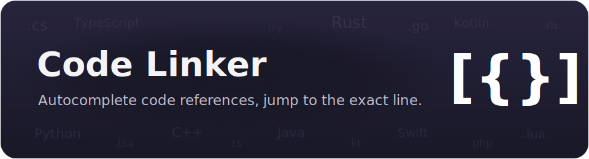
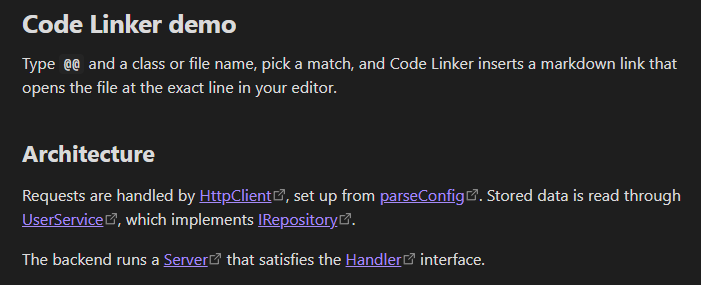
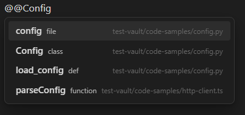
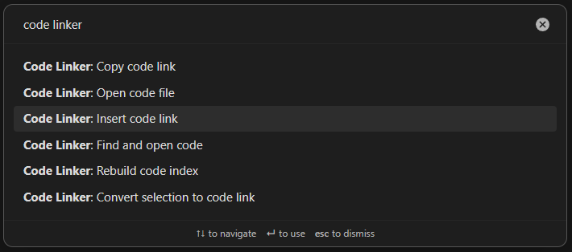
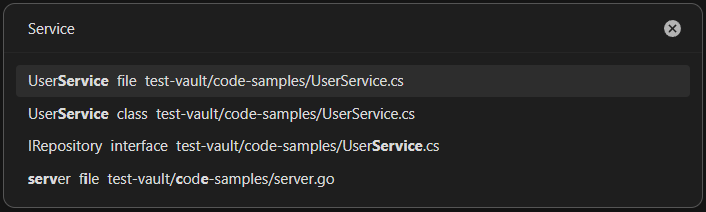
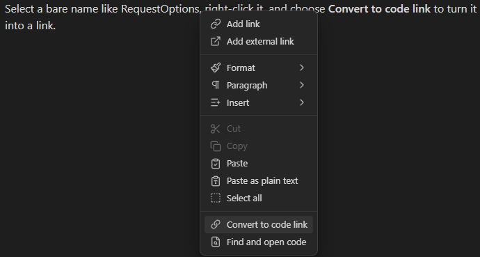
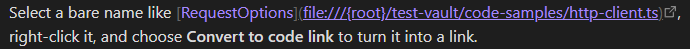
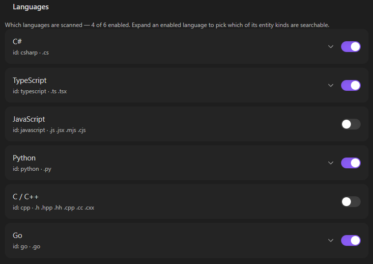
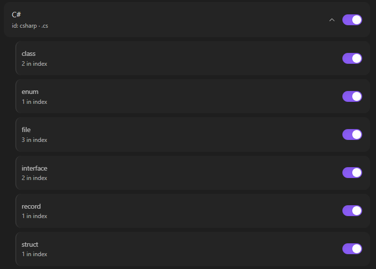

<p align="center">
  
</p>

# Code Linker

An Obsidian plugin that autocompletes references to your **source code** and inserts a markdown link whose URL opens the file at the right line in your editor (VS Code, Rider, …).

<p align="center">
  
</p>

Type a trigger (default `@@`) followed by a class or file name, pick a match, and get something like:

```markdown
[HttpClient](vscode://file/{root}/src/http-client.ts:5)
```

The note keeps the literal `{root}` and a relative path, so it stays portable; `{root}` is filled with your **Code root** when the link is opened (see [Portable `{root}` links](#portable-root-links)).

The plugin ships as `main.js`, `manifest.json` and `styles.css`. The built-in languages live as [`languages/*.json`](languages) and are baked into `main.js` at build time, so it works the moment you install it. The plugin scans the folders you configure (using Node's filesystem API) and keeps the index in memory — there is **no index file to commit and nothing to generate**; the index is rebuilt on startup and on demand. `main.js` is built from `src/` with esbuild (see [Development](#development)).

## Contents

- [What it does](#what-it-does)
  - [Autocomplete as you type](#autocomplete-as-you-type)
  - [Picker commands](#picker-commands)
  - [Selection commands and the context menu](#selection-commands-and-the-context-menu)
  - [Portable `{root}` links](#portable-root-links)
- [Languages](#languages)
- [Searchable entities](#searchable-entities)
- [Settings](#settings)
- [Link targets and URI templates](#link-targets-and-uri-templates)
- [Skipped contexts](#skipped-contexts)
- [Public API](#public-api)
- [Development](#development)
- [Installation](#installation)
- [Compatibility](#compatibility)

## What it does

### Autocomplete as you type

An `EditorSuggest` autocomplete on a configurable trigger, with fuzzy / camelCase matching — `hc` finds `HttpClient`. It indexes file names plus type declarations, with their line numbers, so a suggestion drops you on the exact line. Suggestions are suppressed inside code blocks, inline code, frontmatter and existing links; table cells stay live (a pipe in the link is escaped automatically).

<p align="center">
  
</p>

### Picker commands

A full-screen picker you can bind to hotkeys, in three flavors:

- **Insert code link** — insert a markdown link at the cursor.
- **Open code file** — open the picked file in your editor, without inserting.
- **Copy code link** — copy the markdown link to the clipboard.

<p align="center">
  
  <br><sub>The commands in the palette.</sub>
</p>

<p align="center">
  
  <br><sub>The picker, matching files and type declarations.</sub>
</p>

### Selection commands and the context menu

Selection-driven commands resolve the selected name or path (or the token under the cursor) against the index, then act; a single match runs directly, several open the picker. Both are also in the editor's right-click menu:

- **Convert to code link** — replace the selection with a link.
- **Find and open code** — open the matching file in your editor.

<p align="center">
  
</p>

<p align="center">
  
  <br><sub>The selection becomes a portable link.</sub>
</p>

### Portable `{root}` links

`{root}` is **not** expanded when the link is inserted — the note keeps the literal text `{root}`, and the absolute code root is filled in only when the link is rendered (reading view) or opened (live preview). That keeps notes portable: the file on disk holds a relative path, and the machine-specific base comes from your current **Code root** setting. Use it (e.g. `file:///{root}/{path}`) when you don't want absolute paths baked into your notes.

## Languages

All built-in languages are enabled by default. Only **enabled** languages are scanned: their extensions decide which files are read, and their patterns decide which declarations become entries (files always get a top-of-file entry). Built-ins ship for C#, TypeScript, JavaScript, Python, C/C++ and Go; toggle them on/off with the toggles in settings. The built-ins live as [`languages/*.json`](languages) and are bundled into `main.js` at build time.

<p align="center">
  
</p>

To add or override a language, set **Custom languages → Languages file** to a path in your vault, create that file, and paste the example below as a starting point. Edit and save it — the plugin reloads on save (or click **Reload & rebuild**). An entry whose `id` matches a built-in replaces it.

```json
[
  {
    "id": "rust",
    "name": "Rust",
    "extensions": [".rs"],
    "patterns": [
      { "re": "^\\s*(?:pub\\s+)?(struct|enum|trait)\\s+([A-Za-z_]\\w*)", "kindGroup": 1, "nameGroup": 2 },
      { "re": "^\\s*(?:pub\\s+)?fn\\s+([A-Za-z_]\\w*)", "kind": "fn", "nameGroup": 1 }
    ]
  }
]
```

Each pattern uses either `kindGroup` + `nameGroup` (the kind is read from the match) or `kind` (a fixed label) + `nameGroup` (defaults to group 1). `flags` is optional. Remember to double-escape backslashes inside JSON.

## Searchable entities

Each enabled language lists the entity kinds it actually put in the index (e.g. `class`, `struct`, `file`) right under its toggle in settings. Turn a kind off to hide just that language's entities of that kind from suggestions — so you can keep C# `class` while hiding Go `func`. This is a query-time filter: toggling it is instant and never triggers a re-scan.

<p align="center">
  
</p>

## Settings

| Setting | What it does |
| --- | --- |
| **Code root** | Base folder the scan paths resolve against. Empty = the folder containing the vault. |
| **Scan folders** | One path per line, relative to the code root. Folders that don't exist are flagged here and in a notice on rebuild. |
| **Max file size (KB)** | Files larger than this are indexed by name only, not parsed for declarations (`0` = no limit, default 2048). |
| **Skip folders** | One folder name per line, never descended into (`obj`, `bin`, …). |
| **Trigger** | Text that starts a suggestion (default `@@`). |
| **Editor link preset** | file:// / VS Code / JetBrains / one of your own editors. See [Link targets and URI templates](#link-targets-and-uri-templates). |
| **JetBrains IDE** | Which JetBrains IDE the JetBrains preset opens (shown when it's selected). |
| **Your editors** | Foldable list of named URL templates you add; each appears in the preset dropdown. |
| **Auto-refresh index** | Watch the scan folders and rebuild when code changes. Recursive watching isn't supported on Linux — there, rebuild manually (the plugin says so when it can't watch). |
| **Editor context menu** | Add the **Convert to code link** and **Find and open code** items to the editor's right-click menu. |

The index rebuilds in the background on startup and on demand (command **Code Linker: Rebuild code index**), and — when **Auto-refresh index** is on — automatically when source files change. It is cached to disk, so startup is instant; the background rebuild only re-reads files whose modification time changed.

## Link targets and URI templates

The link target is a URI template with presets:

- **file://** (default) — `file:///{root}/{path}`, opens in the OS default app. Uses the portable `{root}` token.
- **VS Code** — `vscode://file/{root}/{path}:{line}`, using the portable `{root}` token.
- **JetBrains** — `jetbrains://{product}/navigate/reference?project={project}&path={path}:{line}`, where `{product}` is the IDE you pick in the **JetBrains IDE** setting (IntelliJ IDEA, PyCharm, WebStorm, Rider, …).
- **Your editors** — add named presets of your own (Cursor, PyCharm, Sublime, …) using the placeholders below; they show up alongside the built-ins in the dropdown.

### Placeholders

`{abs}` (absolute path, URL-encoded), `{path}` (relative to code root), `{line}`, `{name}`, `{project}` (first path segment), `{product}` (the JetBrains IDE chosen in settings), `{root}` (see [Portable `{root}` links](#portable-root-links)).

The inserted markdown is always `[name](uri)`.

## Skipped contexts

Suggestions never fire inside code blocks (` ``` ` and `~~~`), inline code, frontmatter, or existing `[[...]]` and `[..](..)` links. When a link is written into a Markdown table cell, the pipe is escaped so the table isn't broken.

## Public API

The in-memory index is exposed at `app.plugins.plugins['code-linker'].api`, so other plugins and DataviewJS can read it without re-scanning:

| Method | Returns |
| --- | --- |
| `getEntries()` | every entry — `{ name, kind, lang, path, line }` |
| `getFiles()` | one row per file — `{ name, path, lang, entries }` |
| `getStats()` | `{ files, entries, byLang, byKind }` |
| `getLanguages()` | enabled languages — `{ id, name, extensions }` |
| `find(text)` | entries matching a name or path tail |
| `linkFor(entry)` | the portable `[name](uri)` markdown link |
| `uriFor(entry)` | a ready-to-open absolute URI (`{root}` resolved) |
| `onChange(cb)` | subscribe to rebuilds; returns an unsubscribe function |
| `version`, `codeRoot()` | plugin version; the resolved code root |

The arrays are copies, so mutating them won't touch the live index. A DataviewJS example — count indexed files per language:

````md
```dataviewjs
const api = app.plugins.plugins['code-linker']?.api;
if (!api) { dv.paragraph('Code Linker is not enabled.'); }
else {
  const { byLang } = api.getStats();
  dv.table(['Language', 'Entries'], Object.entries(byLang));
}
```
````

## Development

The plugin is written as small CommonJS modules in `src/` and bundled into `main.js` by esbuild. `main.js` is generated — edit `src/` and rebuild rather than editing it directly.

```sh
npm install      # once, installs esbuild
npm run build    # bundle src/ -> main.js
```

`src/` layout:

- `main.js` — the plugin: settings, language compilation, folder scan, link building.
- `suggest.js` — the `EditorSuggest` that drives autocomplete.
- `settings-tab.js` — the settings UI.
- `builtin-languages.js` — built-in language definitions.
- `modal.js` — the command's `FuzzySuggestModal` picker.
- `api.js` — the public API mixed into the plugin prototype.
- `constants.js` — defaults, URI presets, small string helpers.
- `i18n.js` + `locales/` — interface strings (English and Russian).

To deploy into a test vault on each build, create `esbuild.local.mjs` exporting `deployTargets` (a list of plugin folders to copy the build into). `node_modules/`, `package-lock.json` and `esbuild.local.mjs` are git-ignored.

## Installation

This plugin is desktop-only (it reads the filesystem).

**Via [BRAT](https://github.com/TfTHacker/obsidian42-brat) (recommended):** add the repository `max-fluff/obsidian-code-linker`, enable **Code Linker**, then set **Scan folders** in its settings.

**Manually:** copy `main.js`, `manifest.json` and `styles.css` into `<vault>/.obsidian/plugins/code-linker/`, then enable the plugin in *Settings → Community plugins*.

Once it's accepted into the community catalog it will also be installable from *Settings → Community plugins → Browse*.

## Compatibility

Requires Obsidian 1.4.0 or newer. Desktop-only — the index is built by reading the filesystem through Node's API, which isn't available on mobile. Interface in English and Russian, following Obsidian's language.
